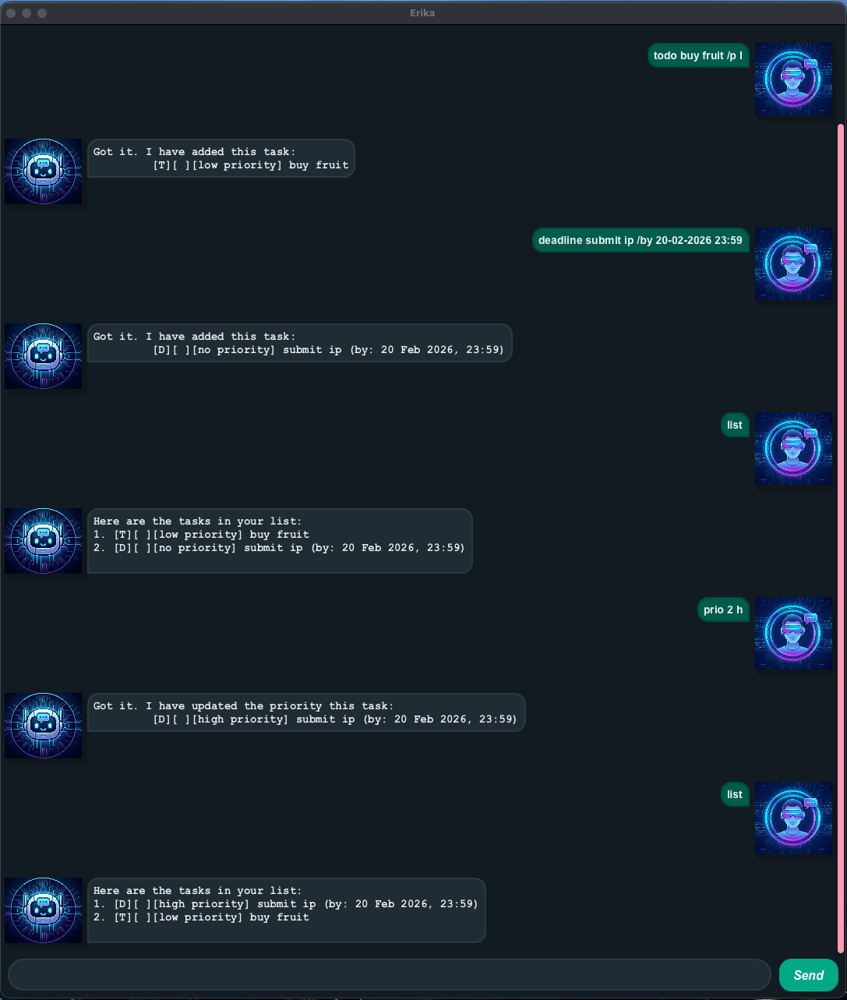

# Erika User Guide
## Product screenshot

<br>
<br>
<br>

## Introduction
> "The key is not to prioritize what's on your schedule, but to schedule your priorities." - Steven Covey ([source](https://dansilvestre.com/productivity-quotes/#4_%E2%80%9CThe_key_is_not_to_prioritize_whats_on_your_schedule_but_to_schedule_your_priorities%E2%80%9D_%E2%80%93_Stephen_Covey))

Erika helps you schedule your priorities by:
- remembering your deadlines
- tracking what you have and have not done
- tracking each task's priority
- understanding your text command in *SUPERFAST* manner

All you need to do is:
1. simply download the latest ```.jar``` file from [here](https://github.com/MrMarshall12/ip/releases)
2. copy the file to your preferred folder
3. open a command terminal, ```cd``` into the folder where you put the jar file in, and run ```java -jar erika.jar``` to start the application.
4. let it manage your tasks for you 🤩

Fret not, it is **FREE!**
<br>
<br>
<br>

## Features
### Viewing help: `help`
Shows what commands are available. <br>
Format: `help`
<br>
<br>
### Adding a todo task: `todo`
Adds a todo task to the list. <br>
Format: `todo <description> /p <priority>` <br>
Priority options: <br>
h = high, m = medium, l = low, n = no priority <br>
If priority is not specified task will be added with no priority. <br>
Examples:
- `todo morning run /p m` 
- `todo go to gym`
<br>
<br>

### Adding a deadline task: `deadline`
Adds a deadline task to the list. <br>
Format: `deadline <description> /by dd-MM-yyyy HH:mm /p <priority>` <br>
Priority options: <br>
h = high, m = medium, l = low, n = no priority <br>
If priority is not specified task will be added with no priority. <br>
Examples: 
- `deadline submit cs2103t ip /by 20-03-2026 18:00 /p h`
- `deadline fill up feedback form /by 20-02-2026 18:00`
<br>
<br>

### Adding an event task: `event`
Adds an event task to the list. <br>
Format: `event <description> /from dd-MM-yyyy HH:mm /to dd-MM-yyyy HH:mm /p <priority>` <br>
Priority options: <br>
h = high, m = medium, l = low, n = no priority <br>
If priority is not specified task will be added with no priority. <br>
Examples:
- `event meeting with prof /from 22-03-2026 15:00 /to 22-03-2026 15:30 /p h`
- `event late night talk with erika /from 22-03-2026 23:00 /to 23-03-2026 00:00`
<br>
<br>

### Listing all tasks: `list`
Shows a list of all tasks. <br>
Format: `list`
<br>
<br>

### Marking a task as done or undone: `mark` or `unmark`
Marks a task as done or undone. <br>
Format: `mark <index>` or `unmark <index>` <br>
Examples:
- `mark 1`
- `unmark 2`
<br>
<br>

### Deleting a task: `delete`
Deletes a task. <br>
format: `delete <index>` <br>
Examples:
- `delete 1`
<br>
<br>

### Assigning priority to a task: `prio`
Assigns priority to a task. <br>
Format: `prio <index> <priority>` <br>
Priority options: <br>
h = high, m = medium, l = low, n = no priority <br>
For this command, the priority must be specified. <br>
Examples:
- `prio 1 h`
<br>
<br>

### Searching for taks by name: `find`
Searches for tasks whose names contain any of the given keywords. <br>
Keywords are case-insensitive. <br>
Format: `find <task_name>` <br>
Examples:
- `find meeting`
- `find meet`
<br>
<br>

### Exiting the program: `bye`
Exits the program.
Format: `bye`
<br>
<br>

### Saving the data
Erika data is saved in the hard disk automatically after any command that changes the data. <br>
Manual saving is unnecessary. 
<br>
<br>

### Editing the data file
The file is saved in [JAR file location]/data/ErikaDatabase.txt <br>

> **Caution!** <br>
> Editing the file manually may cause instantiation failure of the application.

> **Important!** <br>
> If the application suffers from instantiation failure, delete ErikaDatabase.txt and try again.

> **Tip** <br>
> Only edit the list of tasks through the application.

<br>

## Known issues
- The application does not support same-indent text wrapping for indented texts.

## Credits
This project is based on the Duke project provided by [SE-EDU](https://se-education.org). <br>
This user guide was adapted from [AddressBook-Level3](https://se-education.org/addressbook-level3/UserGuide.html) project.